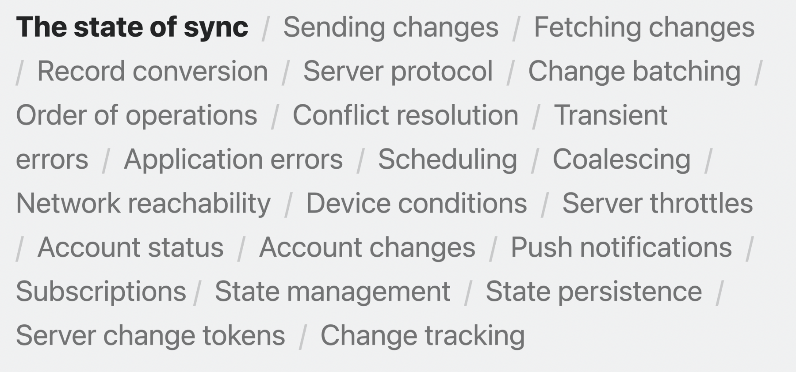

## Sync to iCloud with CKSyncEngine

Presenters:
- Tim Mahoney, CloudKit Engineer
- Aamer Husain, CloudKit Engineer

New CloudKit API called CKSyncEngine

## The State of Sync

- Sync is expected with new apps

"Syncing in general is hard."

- `NSPersistentCloudKitContainer`: Full-stack solution that includes local persistence
- `CKSyncEngine`: BYO local persistence (NEW!) - sync with CloudKit but not using NSPersistentCloudKitContainer
- `CKDatabase` and `CKOperation`: More fine-grained control



"In order to write a proper sync engine, you probably need several thousands of lines of code, and then double that amount in your tests. I actually heard a rumor that NSPersistentCloudKitContainer is backed by over 70,000 lines of tests."

## Meet CKSyncEngine

High-level CloudKit sync API:

- Convenient but flexible
- Private and shared data
- Backward compatible
- Used by many Apple apps

If you already have an existing cloud sync implementation, you can consider switching.

Sync Engine acts as a conduit of data between your app and the server


### Sending changes to the server

1. Someone modifies data. i.e. type something, flip a switch, delete an object.
2. App tells the sync engine there's a pending change to send to the server.
3. Sync engine submits a task to the scheduler.
4. When the device is ready, the scheduler runs the task.
5. When the task runs, the sync engine asks your app for the next batch of changes to send.


If someone made a single modification, you may only have one pending change. If someone imports a huge database of new data, you might have hundreds or thousands of changes. Since there is a limit of how much can be sent to the server in a single request, the sync engine asks for these changes in batches. This helps reduce memory overhead by not bringing any records into memory until they're actually needed.

6. After you provide the next batch, the sync engine sends it to the server.
7. The server responds with the result of the operation, including information about success or failure of the changes. You can react to changes.

If there are more pending changes, the server continues to ask for them in batches until there's nothing left to send.


### Sending changes to other devices

Now that one device has sent changes to the server, other devices fetch the data. 

1. The server sends a push notification to other devices that have access to that data. CKSyncEngine automatically listens for these push notifications to your app. 
2. When CKSyncEngine receives a notification, it submits a task to the scheduler to fetch the updates.
3. When the scheduler task runs, the sync engine fetches from the server.
4. When it fetches new changes, it give them to your app. You can persist changes locally and show them in the UI.


### Scheduler

CKSyncEngine consults the scheduler before doing things. The scheduler monitors system conditions like network connectivity, battery level, resource usage, and more. It makes sure the device has met any prerequisite conditions before it tries to sync.

In normal conditions, sync is within a few seconds. If there's no network connection, or if the device battery is low, sync might be delayed or deferred. 

#### Manually performing a sync

Pull-to-refresh or a button to "backup now"
Can be useful when you are writing tests

Sync engine has an API to manually sync when necessary

## Getting started

### Prerequisites

- `CKRecord` and `CKRecordZone` data types. The sync engine API deals heavily in these concepts so understand what they are.
- Add the CloudKit entitlement (capability?) to your project
- Sync engine relies on notifications, so you must enable remote notifications capability

#### Initialize the sync engine

Do this very soon after app launches. It starts listening for sync notifications and scheduling tasks on the background

Conform to `CKSyncEngineDelegate` protocol

- `CkSyncEngine.State.Serialization`
- Handle `Event.stateUpdate`

You should persist state serialization locally so you can provide it the next time your process launches and you initialize your sync engine

```swift
actor MySyncManager : CKSyncEngineDelegate {
    
    init(container: CKContainer, localPersistence: MyLocalPersistence) {
        let configuration = CKSyncEngine.Configuration(
            database: container.privateCloudDatabase,
            stateSerialization: localPersistence.lastKnownSyncEngineState,
            delegate: self
        )
        self.syncEngine = CKSyncEngine(configuration)
    }
    
    func handleEvent(_ event: CKSyncEngine.Event, syncEngine: CKSyncEngine) async {
        switch event {
        case .stateUpdate(let stateUpdate):
            self.localPersistence.lastKnownSyncEngineState = stateUpdate.stateSerialization
        }
    }
}
```

## Using CKSyncEngine

### Sending changes to the server

Add changes in `CKSyncEngine.State`. This will alert the sync engine that it should schedule a sync. The sync engine will ensure consistency and deduplicate these changes.

Next, implement the delegate method `nextRecordZoneChangeBatch`. The sync engine calls this to get the next batch of record zone changes to send to the server.

Finally, handle the events `sentDatabaseChanges` and `sentRecordZoneChanges`. These events post once changes are sent up to the server.

```swift
func userDidEditData(recordID: CKRecord.ID) {
    // Tell the sync engine we need to send this data to the server.
    self.syncEngine.state.add(pendingRecordZoneChanges: [ .save(recordID) ])
}

func nextRecordZoneChangeBatch(
    _ context: CKSyncEngine.SendChangesContext, 
    syncEngine: CKSyncEngine
) async -> CKSyncEngine.RecordZoneChangeBatch? {

    let changes = syncEngine.state.pendingRecordZoneChanges.filter { 
        context.options.zoneIDs.contains($0.recordID.zoneID) 
    }

    return await CKSyncEngine.RecordZoneChangeBatch(pendingChanges: changes) { recordID in
        self.recordToSave(for: recordID)
    }
}
```

### Fetching changes from the server

`CKSyncEngine` automatically fetches. When it does, handle fetch events using:

- `fetchedDatabaseChanges`
- `fetchedRecordZoneChanges`

You may also need to handle optional fetch events, depending on use case:

- `willFetchChanges`
- `didFetchChanges`

Handling these events may be useful to perform setup or cleanup tasks before or after fetching changes.

```swift
func handleEvent(_ event: CKSyncEngine.Event, syncEngine: CKSyncEngine) async {
    switch event {
        
    case .fetchedRecordZoneChanges(let recordZoneChanges):
        for modifications in recordZoneChanges.modifications {
            // Persist the fetched modification locally
        }

        for deletions in recordZoneChanges.deletions {
            // Remove the deleted data locally
        }

    case .fetchedDatabaseChanges(let databaseChanges):      
        for modifications in databaseChanges.modifications {
            // Persist the fetched modification locally
        }
      
        for deletions in databaseChanges.deletions { 
            // Remove the deleted data locally
        }

    // Perform any setup/cleanup necessary
    case .willFetchChanges, .didFetchChanges:
        break
      
    case .sentRecordZoneChanges(let sentChanges):

        for failedSave in sentChanges.failedRecordSaves {
            let recordID = failedSave.record.recordID

            switch failedSave.error.code {

            case .serverRecordChanged:
                if let serverRecord = failedSave.error.serverRecord {
                    // Merge server record into local data
                    syncEngine.state.add(pendingRecordZoneChanges: [ .save(recordID) ])
                }
            
            case .zoneNotFound: 
                // Tried to save a record, but the zone doesn't exist yet.
                syncEngine.state.add(pendingDatabaseChanges: [ .save(recordID.zoneID) ])
                syncEngine.state.add(pendingRecordZoneChanges: [ .save(recordID) ])
             
            // CKSyncEngine will automatically handle these errors
            case .networkFailure, .networkUnavailable, .serviceUnavailable, .requestRateLimited:
                break
              
            // An unknown error occurred
            default:
                break
            }
        }
      
    case .accountChange(let event):
        switch event.changeType {

        // Prepare for new user
        case .signIn:
            break
          
        // Delete local data
        case .signOut:
            break
          
        // Delete local data and prepare for new user
        case .switchAccounts: 
            break
        }
    }
}
```

### Error Handling

`CKSyncEngine` automatically handles transient errors, such as network issues, throttling, and account issues. The sync engine automatically retries work that is affected by these errors.

For other errors, yoru app must handle them. Once you've resolved thos errors, you should reschedule work if necessary.

#### Conflict Resolution

When handling `failedRecordSaves`, `serverRecordChanged` indicates that the record changed on the server. This means that another device saved a new version that your app hasn't fetched yet. You should resolve the conflict and reschedule the work.

### Private and shared databases

Sharing data with other users is a key part of CloudKit. The sync engine works wit hthe CloudKit shared database. Create a sync engine per database that your application will work with. For example, create a sync engine for the private datbase, another sync engine for the shard database.

```swift
let databases = [ container.privateCloudDatabase, container.sharedCloudDatabase ]

let syncEngines = databases.map {
    var configuration = CKSyncEngine.Configuration(
        database: $0,
        stateSerialization: lastKnownSyncEngineState($0.databaseScope),
        delegate: self
    )
    return CKSyncEngine(configuration)
}
```

## Testing and debugging

Automated tests are good. Using the Sync Engine, simulate device-to-device flows using multiple CKSyncEngine. Simulate specific edge cases.

This test simulates a data conflict between two devices and the server:

```swift
func testSyncConflict() async throws {
    
    // Create two local databases to simulate two devices.
    let deviceA = MySyncManager()
    let deviceB = MySyncManager()
    
    // Save a value from the first device to the server.
    deviceA.value = "A"
    try await deviceA.syncEngine.sendChanges()
    
    // Try to save the value from the second device before it fetches changes.
    // The record save should fail with a conflict that includes the current server record.
    // In this example, we expect the value from the server to win.
    deviceB.value = "B"
    XCTAssertThrows(try await deviceB.syncEngine.sendChanges())
    XCTAssertEqual(deviceB.value, "A")
}
```

## Related Resources

- Tech Talk: Get the most out of CloudKit Sharing
- GitHub sample code: https://github.com/apple/sample-cloudkit-sync-engine
- CKSyncEngine Documentation: https://developer.apple.com/documentation/cloudkit/cksyncengine
